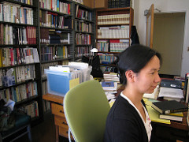

# External Researcher

## Characteristics
The External Researcher wants to access GW ETDs, but she doesn't have access to the ProQuest dissertations database (or doesn't know she has access). She discovers relevant dissertation through references in science journals, and by Googling. Once in the ETD system, she wants to comprehensively find all ETDs on her topic. The External Researcher is not an expert in the ETD system, and prefers to answer her questions without having to contact a librarian.

## Goals
1. The External Researcher wants ready, open access to GW-produced ETDs.
2. The External Researcher wants to find ETDs in the places she already looks for information -- footnotes and Google.
3. Once in the ETD system, the External Researcher wants to be able to find all ETDs on a particular topic.
